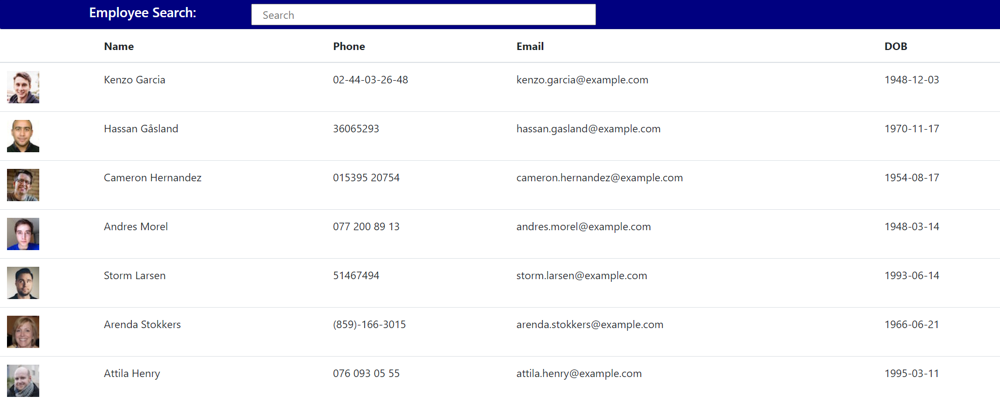

#  **Employee_Directory**

  ## Application Description:
  > *This React application is a directory of random employees. The application calls a random user API, and generates them into a table for the user to view. In this table, a user can sort the employees by name, as well as search employees by name, email, and phone number.*

  Below is a picture of the Application:
  
  

  ## Table of Contents:

  * [Project Description](#description)
  * [Installation Process](#installation)
  * [Usage](#usage)
  * [How to Contribute](#contribution)
  * [License](#license)
  * [Questions](#questions)
  * [Creator Information](#creator)

  ## Installation:
  > *To properly install this application, a user can run 'npm i' in the terminal to download all of the necessary dependencies. Then they can run 'npm start' to kick off the application.*

  ## Usage:
  > *To properly use this application, a user can run 'npm i' in the terminal to download all of the necessary dependencies. Then they can run 'npm start' to kick off the application.*

  ## Contribution:
  > *Contributions are welcome! Please ensure that you are editing in branches and submit pull requests with your adjustments.*

  ## Questions:
  If you have questions, please reach out using the following link
  >[GitHub Profile](http://github.com/Seth-hulsmeyer)

  ## Creator:
  * **Name:** Seth Hulsmeyer
  * **GitHub Username:** Seth-hulsmeyer
  * **Email:** seth.hulsmeyer@hotmail.com

